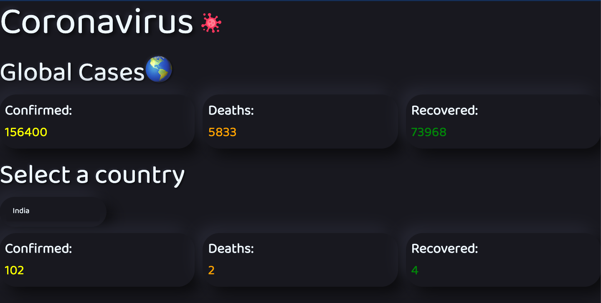

# Corona Tracker
A Coronavirus Tracker built using React and material-ui.

## To Run
- Clone into repo
- Run `npm i`
- Run `npm start` and visit localhost:3000

## Screenshot

## Example
A live demo is hosted [here](https://smcorona.firebaseapp.com/)
